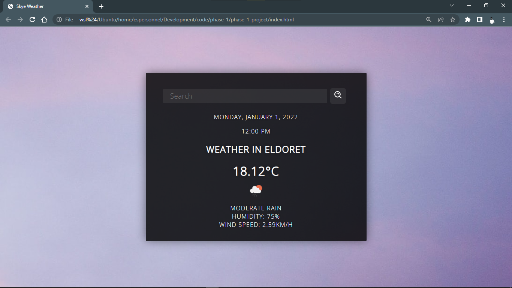

# Phase 1 Project: Skye Weather

    Author: Wycliffe Ndiba

    Languages: HTML, CSS & Javascript

## Description

A web application that displays the current weather for a user-defined location.

This application uses the OpenWeatherMap API to retrieve the current weather.

## Setup

Simply run this link:

Vercel URL: [Skye Weather](https://skye-weather-espersonnel.vercel.app/)

## Deliverables

Some of the deliverables of this project are:

✅ Display the current weather of a city.

✅ The user can input a city name and the application will display the current weather.

✅ Some of the information displayed is:

    ✔ The current temperature.
    ✔ The current weather condition.
    ✔ The current humidity.
    ✔ The current wind speed.
    ✔ The day's maximum/minimum temperature.
    ... The day's date.

### Bonus Deliverables

- The application should show a loading indicator while the weather is being retrieved.
- The application should be able to display an error message if the user enters an invalid city name.
- The application should display weather data for the next 5 days.
- The application should be able to display the current weather for multiple cities at the same time.
- The application should show weather conditions that happened in the past.

## Progress

- The application can search for a city in the search bar.
- The user can either use the Enter key or the search button provided.
- The application can fetch data from the openweathermap API. (Free version)
- The application fetches new background images from Unsplash API.
- The application displays:
    - the city's name
    - temperature in °C
    - an icon describing the condition of the weather
    - the description of the weather (cloudy, sunny)
    - the day's humidity
    - the wind speed.
- Currently working on getting the date and time to function.

## Screenshots

Screenshot showing the features that currently work.

Screenshot with the Current Weather forecast as well as future (5-day) forecast [Feature rolled back for now].

### Rollback
- Rolling back the 5 day forecast till I can understand the logic behind it.

## License
- [License](./LICENSE)

